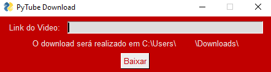

### Olá Mundo👋

---

Me chamo _Alexandre_
Estou tentando aprender Django 
 [LinkedIn](https://www.linkedin.com/in/alexandre-sant-ana-langunno/)

---

### Conheça alguns dos meus Trabalhos

[PyTubeDownload](https://alexandresantanalangunno.github.io/Py_Youtube-Download/)

Eu sou eu ;) (⌐■_■) （￣︶￣）↗　
<!--
**AlexandreSantAnaLangunno/AlexandreSantAnaLangunno** is a ✨ _special_ ✨ repository because its `README.md` (this file) appears on your GitHub profile.

Here are some ideas to get you started:

- 🔭 I’m currently working on ...
- 🌱 I’m currently learning ...
- 👯 I’m looking to collaborate on ...
- 🤔 I’m looking for help with ...
- 💬 Ask me about ...
- 📫 How to reach me: ...
- 😄 Pronouns: ...
- ⚡ Fun fact: ...
-->
